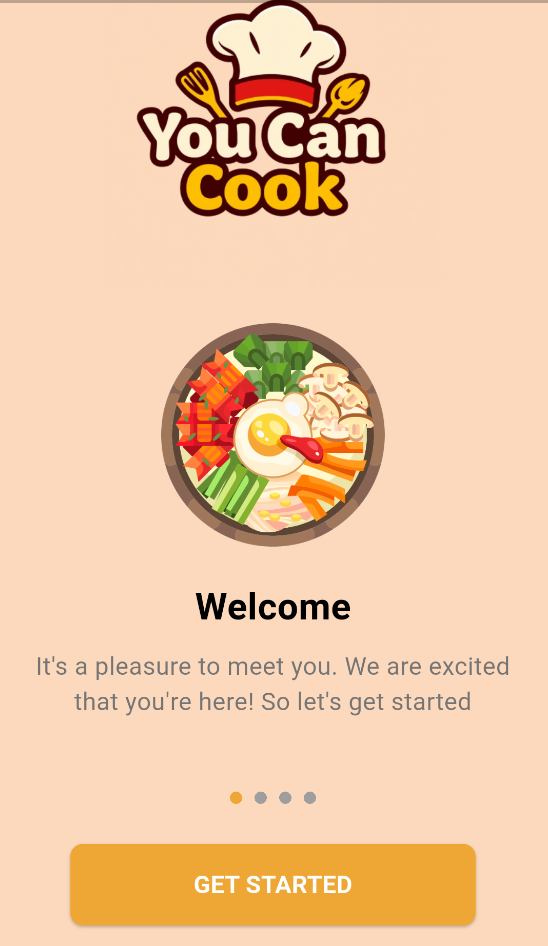
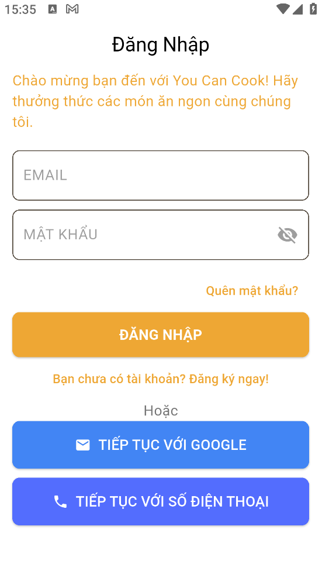
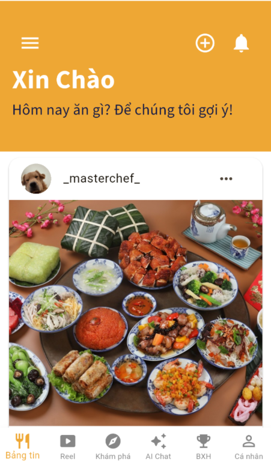
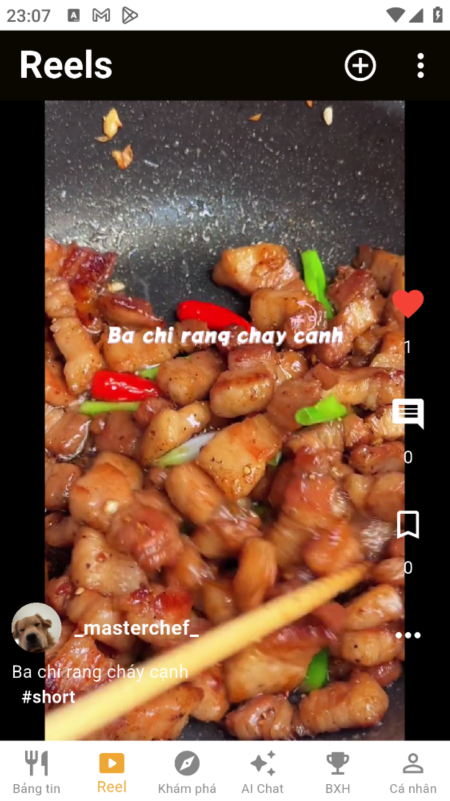
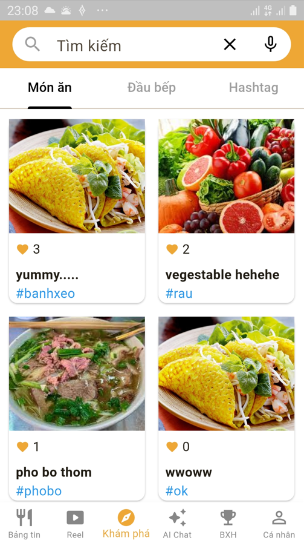
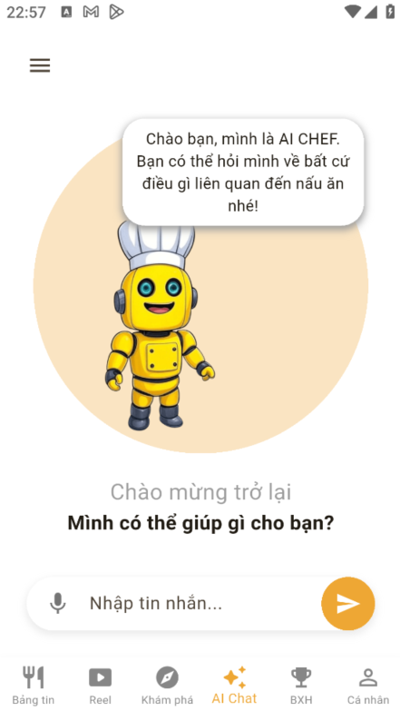
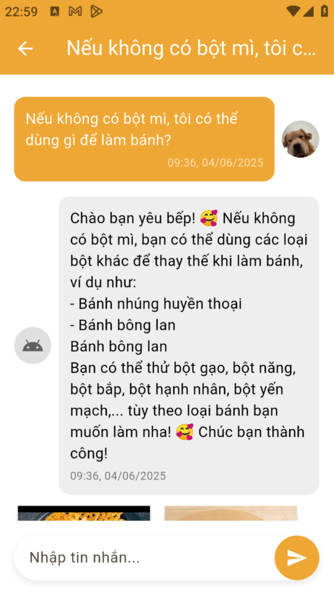
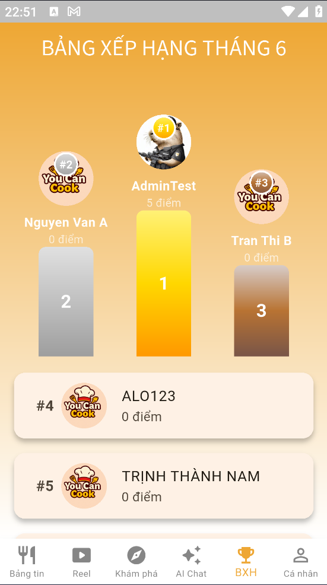

# ĐỒ ÁN TỐT NGHIỆP NĂM 2025

## 🍽️ You Can Cook - Ứng dụng hướng dẫn và chia sẻ các công thức nấu ăn

You Can Cook là một ứng dụng di động giúp người dùng chia sẻ, khám phá và học nấu ăn thông qua các công thức, hình ảnh và trò chuyện trực tiếp với ChatBot. Ứng dụng được xây dựng bằng Flutter, tích hợp với Firebase và Supabase làm backend.

 

---

## 🚀 Tính năng chính

- 📝 Đăng các bài đăng chia sẻ công thức kèm ảnh và hashtag
- 📽️ Đăng tải các video ngắn chia sẻ về cách nấu ăn kèm tiêu đề và hashtag
- ❤️ Thả tim, bình luận trong bài đăng và video
- 🔍 Tìm kiếm người dùng, công thức, từ khóa
- 🧠 Tích hợp Chatbot AI sử dụng mô hình RAG tương tác trực tiếp với người dùng
- 🏆 Bảng xếp hạng người dùng theo điểm thưởng
- ℹ️ Quản lý thông tin cá nhân
- 🔔 Hệ thống thông báo tương tác thời gian thực

---

## 🛠️ Công nghệ sử dụng

| Công nghệ     | Phiên bản                                                             |
| ------------- | --------------------------------------------------------------------- |
| Flutter       | [3.29.0](https://docs.flutter.dev/get-started/install/windows/mobile) |
| Dart          | [3.7.0](https://dart.dev/)                                            |
| firebase_core | [3.12.1](https://pub.dev/packages/firebase_core)                      |
| firebase_auth | [5.5.1](https://pub.dev/packages/firebase_auth)                       |
| flutter_redux | [0.10.0](https://pub.dev/packages/flutter_redux/versions)             |
| redux         | [5.0.0](https://pub.dev/packages/redux)                               |

---

## 🗺️ Mô hình luồng hoạt động của RAG

---

## 📱Giao diện chính trong ứng dụng

  
  
  
  
  
   
    
     
       
  

---

## 🔗 Tải xuống APK

Bạn có thể tải file APK mới nhất từ [GitHub Releases](https://github.com/tnamIT299/You-Can-Cook-Client/releases).

---

## 📄 Giấy phép

[LICENSE](LICENSE).
